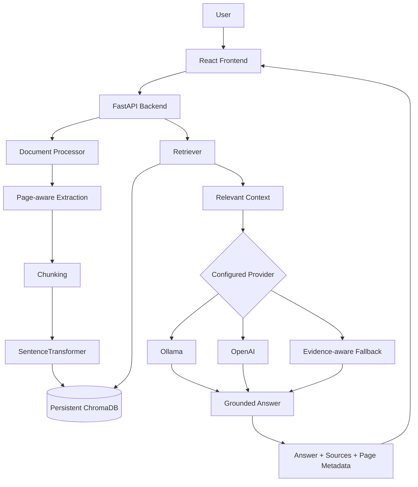

# EnterpriseIQ

EnterpriseIQ is an enterprise document intelligence and Retrieval-Augmented Generation (RAG) assistant. Users upload internal documents and ask questions grounded in those documents, with source and page metadata returned alongside the answer.

It addresses a practical information-retrieval problem: enterprise knowledge is distributed across files, and conventional keyword search can miss semantic relationships. EnterpriseIQ retrieves relevant document context before answer generation so users can find information faster and verify the supporting source. It is designed to reduce unsupported answers through retrieval grounding, source attribution, and explicit no-context refusal behavior; it does not eliminate hallucinations.

## Features

### Document processing

- PDF, TXT, and DOCX upload
- File extension, MIME type, and file-size validation
- Text extraction and normalization
- Page-aware PDF extraction and provenance metadata
- Persistent document metadata and uploaded-file storage

### Retrieval

- Configurable character-based chunking and overlap
- Local SentenceTransformer embeddings using `all-MiniLM-L6-v2`
- Persistent ChromaDB vector storage with cosine similarity
- Configurable `TOP_K` retrieval and relevance threshold
- Document filtering by document ID

### RAG and safety

- Retrieved context passed to the configured provider
- Source attribution with document, page, page range, chunk, and score metadata
- No-context refusal when relevant context is unavailable
- Prompt-injection content treated as untrusted document data
- Evidence-aware deterministic fallback when the configured LLM is unavailable

### LLM providers

- Ollama provider support
- OpenAI provider support
- Provider abstraction with configurable model, temperature, token limit, and timeout

The Ollama integration is implemented, but Ollama was not available for live verification in the current development environment.

## Architecture



ChromaDB is used through its embedded persistent client in the backend. Docker Compose runs the backend and frontend; it does not require a separate Chroma service.

## RAG pipeline

1. **Ingestion:** the API validates the file, extracts text, normalizes it, records metadata, and creates chunks. PDF page boundaries are preserved in chunk metadata.
2. **Embeddings:** SentenceTransformers generates normalized local embeddings with `all-MiniLM-L6-v2`.
3. **Vector storage:** chunk text, embeddings, and metadata are persisted in a ChromaDB collection using cosine distance.
4. **Retrieval:** the question is embedded, then the configured number of nearest chunks are retrieved and filtered by the relevance threshold.
5. **Generation:** retrieved context is passed to the configured Ollama or OpenAI provider with a trusted grounding prompt. The API returns the answer and source metadata.
6. **Fallback:** when the configured provider is unavailable, the deterministic fallback extracts a sentence only when multiple meaningful query terms match the same retrieved sentence. Otherwise it refuses. It is not a replacement for a production LLM.

## Technology stack

### Frontend

- React 18
- Vite
- Tailwind CSS
- Axios
- Vitest and Testing Library

### Backend

- Python
- FastAPI
- Pydantic
- Uvicorn
- python-dotenv

### AI and RAG

- SentenceTransformers
- `all-MiniLM-L6-v2`
- ChromaDB
- Ollama provider support
- OpenAI provider support

### Document processing

- PyMuPDF
- python-docx

### Testing and deployment

- pytest
- Vitest
- Docker
- Docker Compose

## Project structure

```text
EnterpriseIQ/
├── backend/
│   ├── app/                 # FastAPI application and RAG services
│   ├── evaluation/          # Benchmark dataset, corpus, and results
│   ├── scripts/             # Evaluation runner
│   ├── tests/
│   ├── .env.example
│   ├── Dockerfile
│   └── requirements.txt
├── frontend/
│   ├── src/
│   ├── .env.example
│   ├── Dockerfile
│   └── package.json
├── docs/
├── sample_documents/
├── docker-compose.yml
├── .gitignore
└── README.md
```

## Local setup

### Backend

From the repository root:

```bash
python -m venv .venv
```

On macOS/Linux:

```bash
source .venv/bin/activate
```

On Windows PowerShell:

```powershell
.\.venv\Scripts\Activate.ps1
```

Install dependencies and create the backend configuration from the example:

```bash
cd backend
python -m pip install -r requirements.txt
copy .env.example ..\.env
```

On macOS/Linux, use `cp .env.example ../.env` instead of `copy`.

Start the API from the `backend` directory:

```bash
python -m uvicorn app.main:app --reload --host 0.0.0.0 --port 8000
```

### Frontend

In a second terminal:

```bash
cd frontend
npm install
copy .env.example .env
npm run dev -- --host 0.0.0.0 --port 5173
```

On macOS/Linux, use `cp .env.example .env` instead of `copy`.

Open http://localhost:5173.

## Environment variables

The backend loads `.env` from the repository root. The complete backend template is [backend/.env.example](backend/.env.example). The frontend template is [frontend/.env.example](frontend/.env.example).

Backend variables:

| Variable | Purpose | Default |
| --- | --- | --- |
| `APP_NAME` | FastAPI application name | `EnterpriseIQ` |
| `APP_ENV` | Runtime environment label | `development` |
| `DEBUG` | Debug flag | `true` |
| `HOST` | Backend bind host | `0.0.0.0` |
| `PORT` | Backend port | `8000` |
| `UPLOAD_DIRECTORY` | Uploaded-file storage path | `backend/data/uploads` |
| `CHROMA_PERSIST_DIRECTORY` | Persistent Chroma path | `backend/data/chroma` |
| `CHUNK_SIZE` | Chunk size in characters | `800` |
| `CHUNK_OVERLAP` | Chunk overlap in characters | `150` |
| `TOP_K` | Number of retrieved results | `5` |
| `EMBEDDING_MODEL` | SentenceTransformer model | `all-MiniLM-L6-v2` |
| `LLM_PROVIDER` | `ollama`, `openai`, or `fallback` | `ollama` |
| `LLM_MODEL` | Provider model name | `llama3.1` |
| `LLM_TEMPERATURE` | Generation temperature | `0.1` |
| `LLM_MAX_TOKENS` | Generation token limit | `256` |
| `LLM_TIMEOUT_SECONDS` | Provider request timeout | `60` |
| `OPENAI_API_KEY` | OpenAI credential | empty |
| `OLLAMA_BASE_URL` | Ollama API URL | `http://localhost:11434` |
| `RELEVANCE_THRESHOLD` | Minimum retrieval similarity | `0.20` |
| `MAX_FILE_SIZE_MB` | Upload size limit | `10` |
| `CORS_ORIGINS` | Comma-separated allowed origins | `http://localhost:5173` |

The frontend uses `VITE_API_BASE_URL`, defaulting to `http://localhost:8000/api`.

## Ollama and OpenAI

Ollama must be installed separately, and the configured model must be available locally. Configure it with:

```env
LLM_PROVIDER=ollama
LLM_MODEL=llama3.1
OLLAMA_BASE_URL=http://localhost:11434
```

The Ollama integration is implemented, but the current development environment did not have Ollama available for live verification.

OpenAI support uses an environment variable and never requires a key in source control:

```env
LLM_PROVIDER=openai
LLM_MODEL=your_model_name
OPENAI_API_KEY=your_key_here
```

## Docker

Docker support is provided through the backend and frontend Dockerfiles and Compose configuration:

```bash
docker compose config
docker compose build
docker compose up
```

The Compose configuration uses the backend's embedded persistent ChromaDB path and points containerized Ollama requests at `host.docker.internal`. Docker runtime was not available in the development environment, so container execution was not independently verified.

## API

- `GET /api/health`: health status
- `POST /api/documents/upload`: upload and index a PDF, TXT, or DOCX document
- `GET /api/documents`: list indexed documents
- `DELETE /api/documents/{document_id}`: delete an indexed document and stored upload
- `POST /api/chat`: ask a question using available document context

Example chat request:

```json
{
  "query": "What is the annual leave entitlement?",
  "document_ids": []
}
```

The API also exposes interactive FastAPI documentation at `/docs` while the backend is running.

## Evaluation

The benchmark is a corpus-specific evaluation of the included documents and dataset. It is not a general model accuracy or production RAG accuracy claim.

Latest verified results:

| Metric | Result | Meaning |
| --- | ---: | --- |
| Dataset size | 15 | Total benchmark questions |
| Answerable | 10 | Questions with supporting corpus evidence |
| Unanswerable | 5 | Questions intentionally outside the corpus |
| Recall@K | 1.0 | Expected source was retrieved |
| Source hit rate | 1.0 | Expected document was retrieved |
| Page hit rate | 1.0 | Expected page metadata was retrieved |
| Citation rate | 1.0 | Responses included the expected source |
| Evidence-based answer accuracy | 0.8 | Answers contained required evidence |
| No-context accuracy | 1.0 | Unsupported questions were refused |

Evaluation mode: `FALLBACK`.

Real LLM: not available and not verified in the current environment. Run the benchmark with:

```bash
cd backend
python -m scripts.evaluate
```

See [docs/evaluation.md](docs/evaluation.md), [backend/evaluation/README.md](backend/evaluation/README.md), and the generated [backend/evaluation/results.json](backend/evaluation/results.json) for methodology and per-question results.

## Testing

Latest verified results:

Backend:

```text
17 passed
```

```bash
cd backend
python -m pytest -q
```

Frontend:

```text
2 passed
```

```bash
cd frontend
npm test -- --run
```

## Security and responsible use

Implemented controls include:

- File extension, MIME, and file-size validation
- Environment-based API credentials
- Configurable CORS origins
- Sanitized API error responses
- Retrieved documents treated as untrusted content
- Prompt-injection content is not allowed to override the system prompt
- Evidence-aware fallback and explicit no-context refusal

This prototype has no authentication, RBAC, multi-tenant isolation, or production secret manager. Prompt-injection defense has not been formally adversarially benchmarked, and the application is not production hardened.

## Limitations

- Ollama live execution was not verified in the current environment
- Docker runtime was not verified
- Scanned PDFs do not receive OCR
- The fallback is deterministic and not a true LLM
- Evaluation results are corpus-specific and based on a small benchmark
- No authentication, RBAC, or multi-tenant architecture
- Frontend testing is smoke-level
- Retrieval quality depends on chunking, embeddings, and threshold configuration

## Future roadmap

Potential future work, not currently implemented:

- OCR for scanned documents
- Hybrid retrieval and reranking
- Larger evaluation datasets and automated LLM-as-judge evaluation
- Streaming responses
- Authentication and RBAC
- Multi-tenant isolation
- Production observability
- Cloud deployment

## License

No license file is currently included in this repository. Add an explicit license before publishing if you want to grant reuse rights.
